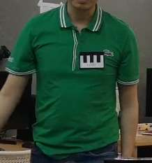
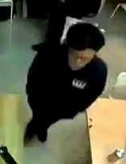

# Object Detection

## **1. Project Brief**
At FootFallCam, we provide rich footfall all data for retail stores as well as advanced analytics and insights to help business decision making. Our 3D sensor uses computer vision and complex AI algorithm to track footfall accurately. One of our key features is staff identification.

A person is identification as a staff if s/he is wearing a staff name tag, as shown below.




As an AI Engineer, you have a few hundred of video samples from our 3D sensor. Here, you are given 1 sample (“sample.mp4”) which is the view from our 3D sensor. Within the clip, there is a person wearing the tag and walking along the corridor. Below are 2 snapshot instances of the person, all other people are not wearing the tag:




**Task**

* Identify which frames in the clip have the staff present?
* Locate the staff xy coordinates when present in the clip.

### **Video**


## **2. Setting Up**

### *Virtual Environment*

To ensure isolated package management and avoid conflicts, create and activate a virtual environment.

**Windows OS**

```py
# Create a virtual environment
python -m venv myenv  # Replace 'myenv' with your desired environment name

# Activate the environment
myenv\Scripts\activate
```

**Install Dependencies**

To install the required libraries, use the `requirements.txt` file.
```py
# Ensure that your requirements.txt file contains all necessary packages for the project.
pip install -r requirements.txt
```


### *Roboflow*
Roboflow is a comprehensive platform designed to simplify the process of building and deploying computer vision models. It provides a suite of tools that cater to various stages of a computer vision project.

| **Feature** |**Description**| **Use in This Project**|
|-------------|---------------|------------------------|
| *Annotation*| Provides an intuitive interface for annotating images, making it easy to label objects within your dataset for training accurate models.| Used for image annotation. |
| *Dataset Management* | Allows efficient organization and management of datasets, supporting various formats and enabling splitting into training, validation, and test sets. | Helps in organizing the annotated dataset.|
| *Augmentation* | Includes powerful augmentation tools to simulate different conditions and variations in data, enhancing dataset robustness and model performance.| N/A |
| *Model Training* | Integrates with popular machine learning frameworks, offering pre-trained models and the ability to train models directly on the platform. | Model is trained using YOLO in Jupyter Notebook.|
| *Deployment* | Simplifies the process of deploying models to different environments, including cloud services and edge devices.| N/A |

Note: For full documentation, please visit [Ultralytics](https://docs.ultralytics.com/#introduction).

### *Training Model*

It is recommended to run the notebook in **Google Colab**, as local execution may lead to various issues. Google Colab offers a stable environment with access to TPU, which can greatly accelerate the training process while minimizing these potential problems.

**This code initializes the YOLO environment by**

* Installing necessary packages
* Importing required modules 
* Clearing the output for a clean workspace.

```py
# Code provide by Roboflow
!pip install ultralytics

from ultralytics import YOLO
import os
from IPython.display import display, Image
from IPython import display
display.clear_output()
```

**Download dataset from Roboflow.** 
```py
# Sample code for downloading the dataset from Roboflow.
!pip install roboflow
from roboflow import Roboflow

rf = Roboflow(api_key="YOUR_API_KEY")  # Use your own API key
project = rf.workspace().project("your-project-name")
dataset = project.version(1).download("yolov8")
```

**Training the model**
```py
!yolo task=detect mode=train model=yolov8n.pt data={dataset.location}/data.yaml epochs=100 imgsz=640 patience=5
```

| **Parameter**| **Description**| **Details**|
|--------------|----------------|------------|
| `!yolo`| Shell command in Jupyter Notebook or Google Colab that executes the YOLO training process. The `!` symbol runs shell commands from a Python environment.| Used to initiate YOLO training.|
| `task=detect`|  Specifies the type of task:<br> • `detect` (object detection) <br> • `segment` (segmentation) <br> • `classify` (image classification) | `detect` is used for object detection in this case.|
| `mode=train`| Specifies the operation mode:<br> • `train` indicates training mode,<br> • `predict` for prediction,<br> • `val` for validation.| Indicates the model is in training mode.|
| `model=yolov8n.pt`| Defines which pre-trained model to use as the base for training. <br> • `yolov8s.pt` (small)<br> • `yolov8m.pt` (medium)<br> • `yolov8l.pt` (large)<br> • `yolov8x.pt` (extra-large)| YOLOv8 is the nano model, a lightweight version designed for faster performance, though it sacrifices some accuracy compared to larger models.|
| `data={dataset.location}/data.yaml` | Specifies the path to the dataset configuration file (`data.yaml`). `dataset.location` points to the dataset's location in the environment.| Contains paths to training/validation data and labels.|
| `epochs=100`| Sets the number of training epochs <br> <br>*Note: complete passes through the training dataset.*| Model will be trained for 100 epochs.|
| `imgsz=640`| Defines the input image size (in pixels) for the model during training.| Images are resized to 640x640 pixels.|
| `patience=5`| Specifies the number of epochs without improvement to wait before early stopping.| Training stops if no improvement after 5 epochs.|

---

## **3. Overview**

This module provides two classes for processing video files and performing object detection.

| **Class**           | **Description**                                                                                         |
|---------------------|---------------------------------------------------------------------------------------------------------|
| `VideoProcessor`    | Handles video frame extraction and processing using OpenCV.                                             |
| `ObjectDetection`   | Leverages YOLO (You Only Look Once) for detecting objects in video files.                               |

### *Video Processor Class*

The `VideoProcessor` class is designed to process video files using OpenCV. It offers functionality to extract frames from the video and display each frame with additional overlay information.

**Attributes**

| **Parameter**        | **Description**                                   |
|----------------------|---------------------------------------------------|
| `video_path (str)`   | Path to the input video file.                     |
| `output_folder (str)`| Directory to save the extracted frames.           |
| `cap`                | OpenCV object to capture video frames.            |

Initialize the VideoProcessor
```py
processor = VideoProcessor(video_path='input_video.mp4', output_folder='output_frames_folder')
```

*Extract frames from the video, starting with frame number 0*
```py
processor.extract_frames()
```

*Process the video, displaying each frame with an overlay of the frame count*
```py
processor.process_video()
```

#### **Functionality**

**`extract_frames(self)`**

Extracts frames from the video file and saves them as image files (`.jpg`). The frames are saved with filenames formatted as `frame_0000.jpg`, `frame_0001.jpg`, etc. The extraction continues until the end of the video.

1. Initializes `frame_count` with the given `count` parameter.

2. Continuously reads frames from the video file while the video capture (`self.cap`) is open.

3. For each frame successfully read (`ret` is `True`):

    * Creates a filename for the frame using the current `frame_count` (e.g., `frame_0000.jpg`).
    * Saves the frame as an image file in the specified output folder using `cv2.imwrite()`.
    * Increments the `frame_count` for the next frame.
4. If no frame is read (`ret` is `False`), the loop breaks, and the extraction process ends.

5. Releases the video capture object and prints the total number of frames extracted.

```python
def extract_frames(self):
    """
    Extract frames from the video file and save them as image files.
    """
    count = 0
    while self.cap.isOpened():
        ret, frame = self.cap.read()
        if not ret:
            break
        frame_filename = os.path.join(self.output_folder, f'frame_{frame_count:04d}.jpg')
        cv2.imwrite(frame_filename, frame)
        frame_count += 1
    self.cap.release()
    print(f'Total frames extracted: {frame_count}')
```

**`process_video(self)`**

Processes the video file by displaying each frame and overlaying the frame count on the video. The video display can be interrupted by pressing the 'q' key.

1. Initializes `frame_count` to `0`.

2. Continuously reads frames from the video file while the video capture (`self.cap`) is open.

3. For each frame successfully read (`ret` is `True`):
    * Overlays the current frame count on the frame using `cv2.putText()`.
    * Displays the frame in a window titled 'Sample-Video' using `cv2.imshow()`.
    * Optionally, you can move the window position using `cv2.moveWindow()` (commented out in the code).

4. Listens for user input:
    * If the 'q' key is pressed, the loop breaks, and the video display is interrupted.

5. After the loop ends, releases the video capture object and closes all OpenCV windows using `cv2.destroyAllWindows()`.

```python
def process_video(self):
    """
    Process the video file, display each frame, and overlay the frame count.
    """
    frame_count = 0
    while self.cap.isOpened():
        ret, frame = self.cap.read()
        if not ret:
            break
        # Overlay the frame count on the frame
        cv2.putText(
            frame, f'Frame: {frame_count}', (10, 30), cv2.FONT_HERSHEY_SIMPLEX, 1, (0, 0, 255), 2, cv2.LINE_AA)
        cv2.imshow('Sample-Video', frame)
        # cv2.moveWindow('Sample-Video', 0, 0)

        if cv2.waitKey(25) & 0xFF == ord('q'):
            break

        frame_count += 1

    self.cap.release()
    cv2.destroyAllWindows()
```

**`__del__(self)`**

Releases the video capture object and destroys all OpenCV windows when the `VideoProcessor` object is deleted.

1. Checks if the `VideoProcessor` object has a `cap` attribute and if it is currently opened.
   - If `self.cap` exists and is open (`self.cap.isOpened()` returns `True`), the video capture object is released using `self.cap.release()`.
2. Closes all OpenCV windows using `cv2.destroyAllWindows()`.

```python
def __del__(self):
    """
    Release the video capture and destroy all OpenCV windows.
    """
    if hasattr(self, 'cap') and self.cap.isOpened():
        self.cap.release()
    cv2.destroyAllWindows()
```

### **Object Detection Class**

A class to perform object detection on a video file using a YOLO model.

**Attributes**

| **Parameter**        | **Description**                                                                                     |
|----------------------|-----------------------------------------------------------------------------------------------------|
| `video_path` (str)   | Path to the input video file.                                                                       |
| `model` (YOLO)      | YOLO model loaded from the specified `model_path`. Used for performing object detection on video frames. |


Initializes the `ObjectDetection` object with the path to the video file and the path to the YOLO model.
```python
# Create an ObjectDetection instance with the video path and model path
detector = ObjectDetection('input_video.mp4', 'yolov8n.pt')
detector.detect_objects()
```

#### **Functionality**

**`detect_objects(self)`**

1. Invokes the object detection model on the specified video or image source (self.video_path).

2. Sets the following parameters for the model's prediction:
    * `show=True` : Displays the detection results in a window.
    * `conf=0.4` : Uses a confidence threshold of 0.4 for detected objects.
    * `save=True` : Saves the detection results.
    * `stream=True` : Streams detection results in real-time.

3. Iterates over the detection results for each frame or image.
    * Extracts bounding boxes using `r.boxes`.
    * Extracts segmentation masks using `r.masks`.
    * Extracts class probabilities using `r.probs`.

4. Prints "Object detection completed" after processing all frames/images.

```py
def detect_objects(self):
    results = self.model(
        source=self.video_path, show=True, conf=0.4, save=True, stream=True)

    for r in results:
        boxes = r.boxes  # Bounding box outputs
        masks = r.masks  # Segmentation masks outputs
        probs = r.probs  # Class probabilities for classification outputs

    print("Object detection completed.")
```

### **Image Retrieval Class**

A class to identify the image from a dataset that is most similar to the target image.

**Attributes**

| **Attribute**            | **Description**                                                                                     |
|--------------------------|-----------------------------------------------------------------------------------------------------|
| `self.sift`              | Instance of the SIFT feature extractor for detecting key points and computing descriptors.         |
| `self.flann`             | Instance of the FLANN-based matcher for matching descriptors between images.                        |
| `self.index_params`      | Parameters for FLANN matching (e.g., algorithm and number of trees).                               |
| `self.search_params`     | Search parameters for FLANN matching (e.g., number of checks).                                     |


Initializes the `ImageRetriever` object with the path to the images folder and targeted image.
```python
# if __name__ == "__main__":
    target_image_path = 'media\\project\\white-shirt-staff.png'  # Path to the image you want to find
    dataset_folder = 'media\\extracted_frames'             # Folder containing the sample of 100 images

    # Create an instance of ImageRetriever
    image_retriever = ImageRetriever()
    best_match = image_retriever.find_best_match(target_image_path, dataset_folder)

    print(f"The image most similar to the target is: {best_match}")
```

#### **Functionality**

**`extract_sift_features(self, image_path)`**

1. Read the Image by using OpenCV's `imread` to load the image in grayscale mode for feature extraction.
    * `image_path`: Path to the image file.
    * `cv2.IMREAD_GRAYSCALE`: Loads the image in grayscale to simplify data and focus on structure.

2. Check Image Load Success
    * If `image is None`, the image could not be read (e.g., incorrect path).
    * Provides feedback for debugging by indicating the issue with the image path.

3. Extract Features with by using SIFT (`detectAndCompute`) to extract feature.
    * `keypoints`: List of important locations/features detected.
    * `descriptors`: Numerical representation of the keypoints for matching.

4. Return Features
    * Returns the extracted keypoints and descriptors as a tuple for further processing.

```python
def extract_sift_features(self, image_path):
    image = cv2.imread(image_path, cv2.IMREAD_GRAYSCALE)
    if image is None:
        raise ValueError(f"Could not read image at path: {image_path}")
    keypoints, descriptors = self.sift.detectAndCompute(image, None)
    return keypoints, descriptors
```

**`match_features(self, descriptors1, descriptors2)`**

1. Match features between two sets of descriptors using the FLANN-based matcher.
    * descriptors1: Descriptors of the first image.
    * descriptors2: Descriptors of the second image.

2. Check Matches
    * Uses FLANN's `knnMatch` to find the two closest matches (k=2) for each descriptor in descriptors1.

3. Filter Good Matches
    * Applies Lowe's ratio test to filter out poor matches.
    * good_matches: List of matches where the distance of the best match is less than 0.7 times the distance of the second-best match.

4. Return Matches Count
    * Returns the number of good matches found.

```python
def match_features(self, descriptors1, descriptors2):
    matches = self.flann.knnMatch(descriptors1, descriptors2, k=2)

    # Apply Lowe's ratio test to filter good matches
    good_matches = [m for m, n in matches if m.distance < 0.7 * n.distance]
    
    return len(good_matches)
```

**`find_best_match(self, target_image_path, dataset_folder)`**

1. Find the image in the dataset that best matches the target image.
    * target_image_path: Path to the target image.
    * dataset_folder: Path to the folder containing dataset images.

2. Extract Features from Target Image
    * Calls `extract_sift_features` to get keypoints and descriptors of the target image.
    * target_keypoints: Keypoints of the target image.
    * target_descriptors: Descriptors of the target image.

3. Initialize Best Match Variables
    * best_match_count: Counter for the best match found (initially 0).
    * best_match_image: Placeholder for the filename of the best-matching image (initially None).

4. Iterate Through Dataset Images
    * For each image file in the dataset folder:
    * Constructs the full path for the image.
    * Calls `extract_sift_features` to get descriptors of the dataset image.
    * Calls `match_features` to compare target descriptors with dataset descriptors.
    * If the current match count exceeds the best match count:
    * Update best_match_count and best_match_image with the current image.

5. Return Best Match
    * Returns the filename of the best-matching image found in the dataset.

```python
def find_best_match(self, target_image_path, dataset_folder):
    target_keypoints, target_descriptors = self.extract_sift_features(target_image_path)
    
    best_match_count = 0
    best_match_image = None
    
    for image_file in os.listdir(dataset_folder):
        image_path = os.path.join(dataset_folder, image_file)
        
        _, dataset_descriptors = self.extract_sift_features(image_path)
        
        match_count = self.match_features(target_descriptors, dataset_descriptors)
        
        if match_count > best_match_count:
            best_match_count = match_count
            best_match_image = image_file
    
    return best_match_image
```

## **4. Script**

Define the path to the video file, output folder, and model path
```python
from business_logic import *


video_path = 'sample.mp4'  # Path to the input video file
output_folder = 'extracted_frames'  # Folder to save extracted frames
model_path = 'model'  # Path to the YOLO model
```

Create VideoProcessor instance and frame extraction and video processing
```python
processor = VideoProcessor(video_path, output_folder)  # Create VideoProcessor instance
processor.process_video()  # Display the video with frame count overlay
processor.extract_frames()  # Extract frames and save them as images
```

Create ObjectDetection instance and detect objects in the video
```python
detector = ObjectDetection(video_path, model_path)
detector.detect_objects()
```

## **5. Results**

Currently, multiple object detection models are implemented, with the nano version and the larger version being actively used to produce detection results as shown below:

1. YOLO 8X Model (Human Detection)


2. YOLO 8X Model (Nametag Detection)


3. YOLO 8X Model (Targeted Staff)


4. YOLO 8N Model (Targeted staff with 100 epoch)
.pt.mp4)

